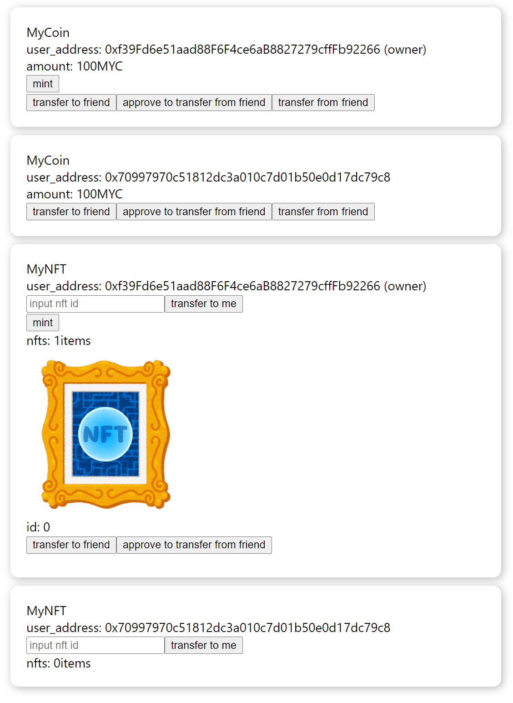

# etherium-poc

etherium-pocはブロックチェーンアプリケーションを試しに動かしてみるアプリケーションです



参考書籍: [ブロックチェーン実践入門](https://books.google.com/books?id=-toBEAAAQBAJ&printsec=copyright)

なお書籍の技術は若干古い上、関連技術のバージョンアップに伴う破壊的変更により書籍の通りに実行しても動作しないため、下記のリプレースを行っています

* geth => hardhat
* web3.js => ethers
* html, Javascript => React

## usage

### ブロックチェーンを起動する
```bash
cd deploy-contract
npm install(初回のみ)
npm start
```

hardhatによりガス代をチャージしたアカウントが10アカウント作成されますが、サンプルアプリケーションでは、そのうち2名のアカウントを利用します。

* アカウント1: 0xf39Fd6e51aad88F6F4ce6aB8827279cffFb92266
* アカウント2: 0x70997970c51812dc3a010c7d01b50e0d17dc79c8

ブロックチェーンが起動した状態で下記のコマンドを実行し、アカウント1のガス代を利用してスマートコントラクトをデプロイします。

```bash
cd deploy-contract
npm run deploy
```

アカウント1はコントラクトに対してオーナー権限を持つことになります。

トークンのmintはアカウント1のみが行うことができます。

### フロントエンドアプリケーションを起動する
```
cd frontend
npm install(初回のみ)
npm start
```

画面の操作によって下記のトランザクションを実行できます。

* 仮想通貨をmintする(ownerのみ)
* 仮想通貨を譲渡する
* 仮想通貨の譲渡を許可する
* 友人の仮想通貨を自分に譲渡する

* NFTをmintする(ownerのみ)
* NFTを譲渡する
* NFTの譲渡を許可する
* 友人のNFTを自分に譲渡する

サンプルアプリケーションでは簡単にするため下記を固定値にしています。

* 譲渡先、譲渡元アカウント
* 仮想通貨の移動金額
* NFTの画像URL

友人の資産を自分に譲渡するには、事前に譲渡の許可を行う必要があります。
許可がない場合エラーが発生します。

### CLIでコントラクトを実行する

フロントエンドでボタンを押した時と同様の挙動をCLIでも再現できます

下記のコマンドでスクリプトを起動すると選択肢が出てきます、適宜選択する事でコントラクトを実行します。

```
cd cli
go run ./
```